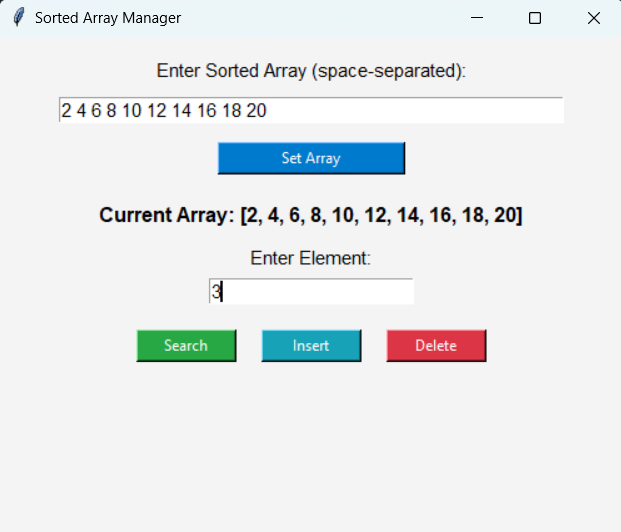
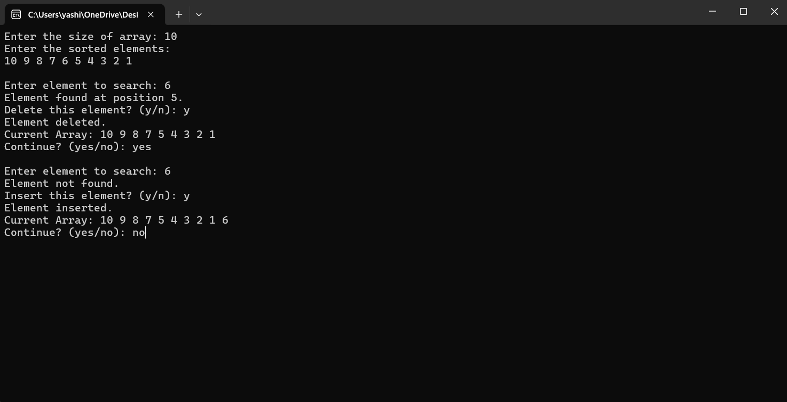

# Sorted Array Manager (CLI + GUI Version)

This is a Command-Line Interface (CLI) based project written in C++ that implements core operations on a sorted array using Binary Search. It allows users to search, insert, and delete elements while ensuring the array remains sorted at all times. Additional details : GUI using Python's Tkinter is also added.
The program is modularized using separate header files for each operation (binary search, insertion, deletion, and utility display), demonstrating good software design principles.
This project includes:
- ✅ Command-Line Interface (CLI) Version using C++
- 🎨 Graphical User Interface (GUI) Version using Python's Tkinter
---

## 📌 Features

### 🖥️ CLI Version (C++)
- Binary Search to locate elements
- Delete element if found (maintains sorted order)
- Insert element if not found (inserts at correct sorted position)
- User-driven input and loop to perform multiple operations

### 🎛️ GUI Version (Python + Tkinter)
- Clean and modern graphical interface
- Space-separated array input
- Buttons for:
  - 🔍 Search
  - ➕ Insert
  - ➖ Delete
- Automatically keeps the array sorted
- Real-time array display with color-coded feedback

## How to Run

1. **Clone the repository:**

   ```bash
   git clone https://github.com/YashitaaArya/SortedArrayManager_CLI.git
   cd SortedArrayManager_CLI
   ```
2. **Compile the code:**

   Make sure you have a C++ compiler installed.

   ```bash
   g++ -o BinarySearchApp main.cpp
   ```
3. **Run the executable:**
   ```bash
   ./BinarySearchApp      # On Linux/macOS
    BinarySearchApp.exe    # On Windows
   ```
4. **Follow on-screen instructions to search, insert, or delete elements.**

## Code Structure
    main.cpp : Contains the main program logic.
    Functions:
    - binarySearch() : Performs binary search on the array.
    - insert() : Inserts an element into the sorted array.
    - deleteElement() : Deletes an element from the array.

## Example
```bash
Enter the size of array: 5
Enter the elements:
1 3 5 7 9
Enter the element to be searched: 5
Element found at 3 position.
Do you wish to delete the same element? (y/n)
y
Successfully deleted!
1 3 7 9
Continue the search? (yes/no)
no
```

## 🖼️ GUI (Python Tkinter)
Make sure Python is installed (version 3.6+ recommended).
```bash
python sorted_array_manager_gui.py
```
## 📸 Screenshot (for GUI)





## 📚 Technologies Used
- C++ (CLI)
- Python 3.x (GUI)
- Tkinter for graphical interface
- Git & GitHub for version control

## Requirements
- C++ compiler (g++, clang++, or Visual Studio)
- Basic command-line environment
- Python's Tkinter

## License
  This project is licensed under the MIT License.
  
---

## Author
 Yashitaa Arya
